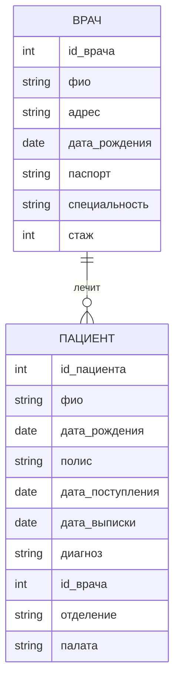
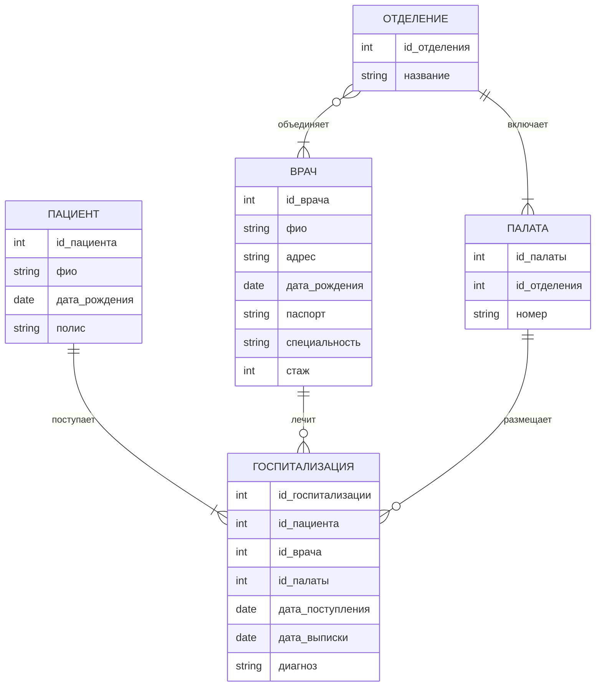
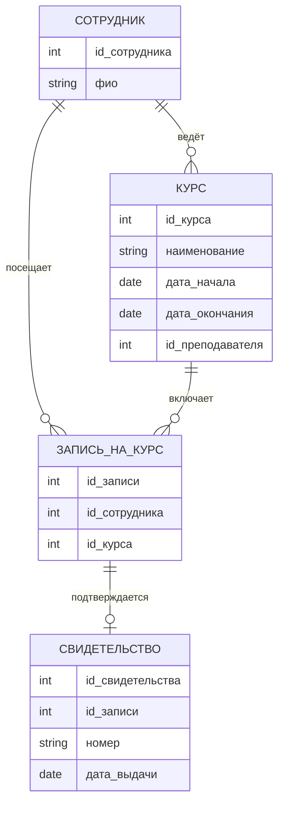
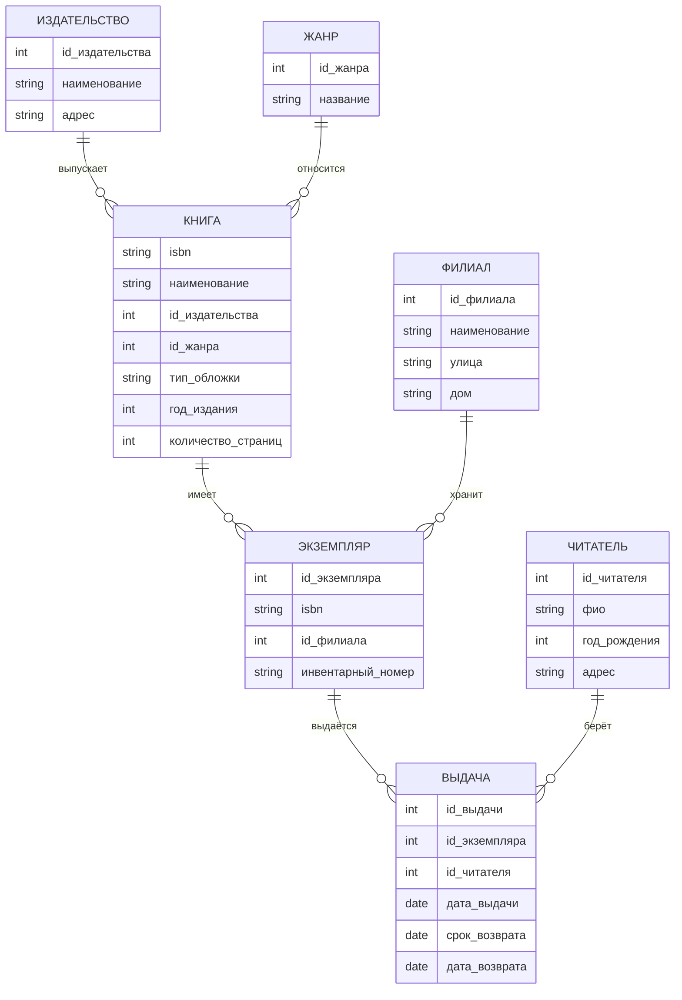
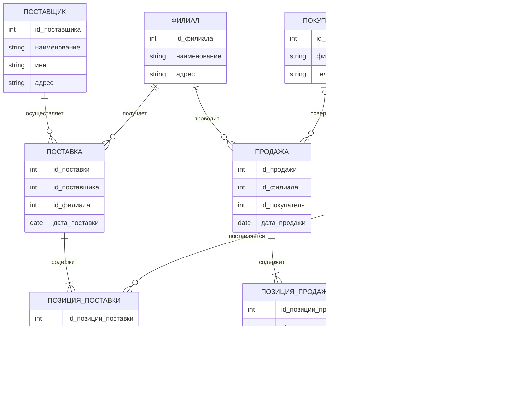
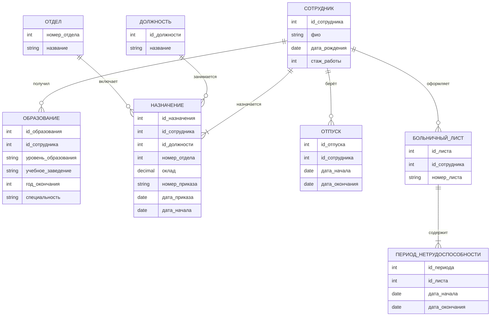

# Занятие 6: ER-диаграммы

## 1. Больница

```mermaid
erDiagram
    ВРАЧ {
        int id_врача
        string фио
        string адрес
        date дата_рождения
        string паспорт
        string специальность
        int стаж
    }

    ПАЦИЕНТ {
        int id_пациента
        string фио
        date дата_рождения
        string полис
        date дата_поступления
        date дата_выписки
        string диагноз
        int id_врача
        string отделение
        string палата
    }

    ВРАЧ ||--o{ ПАЦИЕНТ : "лечит"
```

```mermaid
erDiagram
    ОТДЕЛЕНИЕ {
        int id_отделения
        string название
    }

    ПАЛАТА {
        int id_палаты
        int id_отделения
        string номер
    }

    ВРАЧ {
        int id_врача
        string фио
        string адрес
        date дата_рождения
        string паспорт
        string специальность
        int стаж
    }

    ПАЦИЕНТ {
        int id_пациента
        string фио
        date дата_рождения
        string полис
    }

    ГОСПИТАЛИЗАЦИЯ {
        int id_госпитализации
        int id_пациента
        int id_врача
        int id_палаты
        date дата_поступления
        date дата_выписки
        string диагноз
    }

    ОТДЕЛЕНИЕ ||--|{ ПАЛАТА : "включает"
    ОТДЕЛЕНИЕ }o--|{ ВРАЧ : "объединяет"
    ПАЦИЕНТ ||--|{ ГОСПИТАЛИЗАЦИЯ : "поступает"
    ВРАЧ ||--o{ ГОСПИТАЛИЗАЦИЯ : "лечит"
    ПАЛАТА ||--o{ ГОСПИТАЛИЗАЦИЯ : "размещает"
```

## 2. Повышение квалификации

```mermaid
erDiagram
    СОТРУДНИК {
        int id_сотрудника
        string фио
    }

    КУРС {
        int id_курса
        string наименование
        date дата_начала
        date дата_окончания
        int id_преподавателя
    }

    ЗАПИСЬ_НА_КУРС {
        int id_записи
        int id_сотрудника
        int id_курса
    }

    СВИДЕТЕЛЬСТВО {
        int id_свидетельства
        int id_записи
        string номер
        date дата_выдачи
    }

    СОТРУДНИК ||--o{ КУРС : "ведёт"
    СОТРУДНИК ||--o{ ЗАПИСЬ_НА_КУРС : "посещает"
    КУРС ||--o{ ЗАПИСЬ_НА_КУРС : "включает"
    ЗАПИСЬ_НА_КУРС ||--o| СВИДЕТЕЛЬСТВО : "подтверждается"
```

## 3. Библиотека

```mermaid
erDiagram
    ФИЛИАЛ {
        int id_филиала
        string наименование
        string улица
        string дом
    }

    ИЗДАТЕЛЬСТВО {
        int id_издательства
        string наименование
        string адрес
    }

    ЖАНР {
        int id_жанра
        string название
    }

    КНИГА {
        string isbn
        string наименование
        int id_издательства
        int id_жанра
        string тип_обложки
        int год_издания
        int количество_страниц
    }

    ЭКЗЕМПЛЯР {
        int id_экземпляра
        string isbn
        int id_филиала
        string инвентарный_номер
    }

    ЧИТАТЕЛЬ {
        int id_читателя
        string фио
        int год_рождения
        string адрес
    }

    ВЫДАЧА {
        int id_выдачи
        int id_экземпляра
        int id_читателя
        date дата_выдачи
        date срок_возврата
        date дата_возврата
    }

    ИЗДАТЕЛЬСТВО ||--o{ КНИГА : "выпускает"
    ЖАНР ||--o{ КНИГА : "относится"
    КНИГА ||--o{ ЭКЗЕМПЛЯР : "имеет"
    ФИЛИАЛ ||--o{ ЭКЗЕМПЛЯР : "хранит"
    ЭКЗЕМПЛЯР ||--o{ ВЫДАЧА : "выдаётся"
    ЧИТАТЕЛЬ ||--o{ ВЫДАЧА : "берёт"
```

## 4. Аптека

```mermaid
erDiagram
    ЛЕКАРСТВО {
        int id_лекарства
        string наименование
        string производитель
        string тип
        boolean без_рецепта
    }

    ЦЕНА {
        int id_цены
        int id_лекарства
        decimal цена
        date дата_установки
    }

    ПОСТАВЩИК {
        int id_поставщика
        string наименование
        string инн
        string адрес
    }

    ФИЛИАЛ {
        int id_филиала
        string наименование
        string адрес
    }

    ПОСТАВКА {
        int id_поставки
        int id_поставщика
        int id_филиала
        date дата_поставки
    }

    ПОЗИЦИЯ_ПОСТАВКИ {
        int id_позиции_поставки
        int id_поставки
        int id_лекарства
        int количество
        decimal закупочная_цена
    }

    ПОКУПАТЕЛЬ {
        int id_покупателя
        string фио
        string телефон
    }

    ПРОДАЖА {
        int id_продажи
        int id_филиала
        int id_покупателя
        date дата_продажи
    }

    ПОЗИЦИЯ_ПРОДАЖИ {
        int id_позиции_продажи
        int id_продажи
        int id_лекарства
        int количество
        decimal цена
        string номер_рецепта
    }

    ЛЕКАРСТВО ||--|{ ЦЕНА : "имеет"
    ПОСТАВЩИК ||--o{ ПОСТАВКА : "осуществляет"
    ФИЛИАЛ ||--o{ ПОСТАВКА : "получает"
    ПОСТАВКА ||--|{ ПОЗИЦИЯ_ПОСТАВКИ : "содержит"
    ЛЕКАРСТВО ||--o{ ПОЗИЦИЯ_ПОСТАВКИ : "поставляется"
    ФИЛИАЛ ||--o{ ПРОДАЖА : "проводит"
    ПОКУПАТЕЛЬ |o--o{ ПРОДАЖА : "совершает"
    ПРОДАЖА ||--|{ ПОЗИЦИЯ_ПРОДАЖИ : "содержит"
    ЛЕКАРСТВО ||--o{ ПОЗИЦИЯ_ПРОДАЖИ : "продаётся"
```

## 5. Предприятие

```mermaid
erDiagram
    СОТРУДНИК {
        int id_сотрудника
        string фио
        date дата_рождения
        int стаж_работы
    }

    ОБРАЗОВАНИЕ {
        int id_образования
        int id_сотрудника
        string уровень_образования
        string учебное_заведение
        int год_окончания
        string специальность
    }

    ДОЛЖНОСТЬ {
        int id_должности
        string название
    }

    ОТДЕЛ {
        int номер_отдела
        string название
    }

    НАЗНАЧЕНИЕ {
        int id_назначения
        int id_сотрудника
        int id_должности
        int номер_отдела
        decimal оклад
        string номер_приказа
        date дата_приказа
        date дата_начала
    }

    ОТПУСК {
        int id_отпуска
        int id_сотрудника
        date дата_начала
        date дата_окончания
    }

    БОЛЬНИЧНЫЙ_ЛИСТ {
        int id_листа
        int id_сотрудника
        string номер_листа
    }

    ПЕРИОД_НЕТРУДОСПОСОБНОСТИ {
        int id_периода
        int id_листа
        date дата_начала
        date дата_окончания
    }

    СОТРУДНИК ||--o{ ОБРАЗОВАНИЕ : "получил"
    СОТРУДНИК ||--|{ НАЗНАЧЕНИЕ : "назначается"
    ДОЛЖНОСТЬ ||--o{ НАЗНАЧЕНИЕ : "занимается"
    ОТДЕЛ ||--o{ НАЗНАЧЕНИЕ : "включает"
    СОТРУДНИК ||--o{ ОТПУСК : "берёт"
    СОТРУДНИК ||--o{ БОЛЬНИЧНЫЙ_ЛИСТ : "оформляет"
    БОЛЬНИЧНЫЙ_ЛИСТ ||--|{ ПЕРИОД_НЕТРУДОСПОСОБНОСТИ : "содержит"
```
