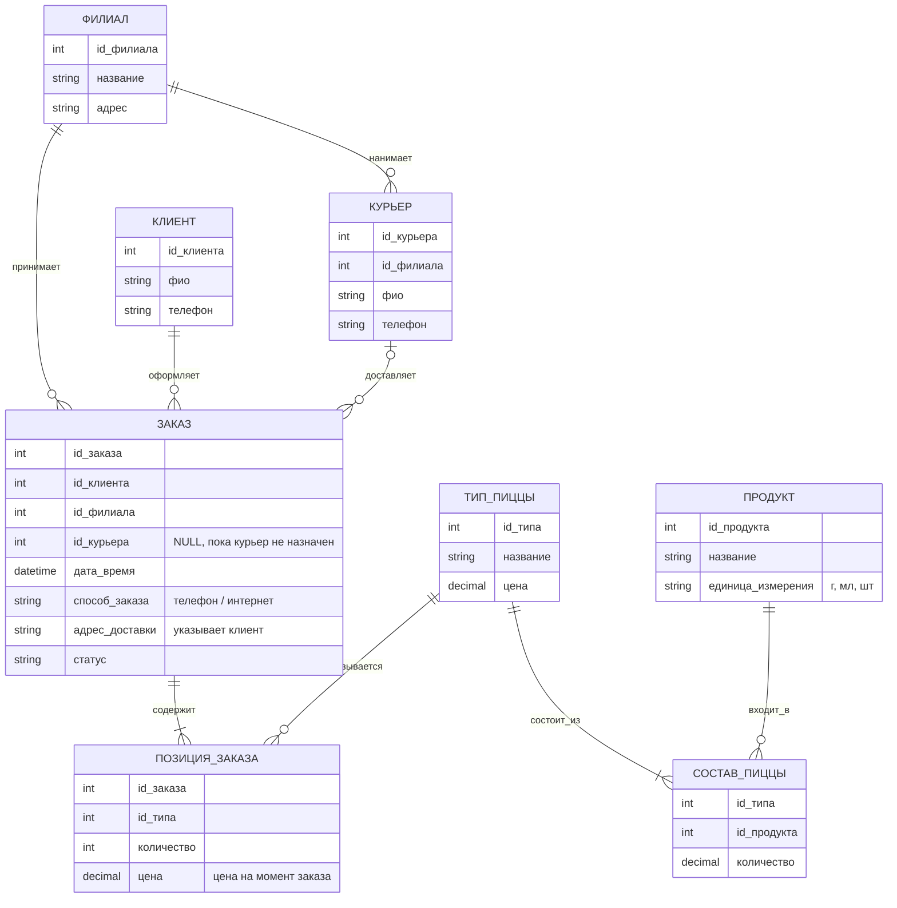
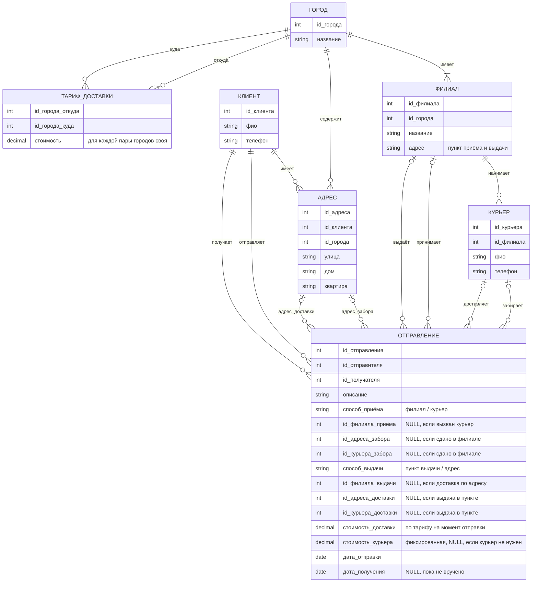
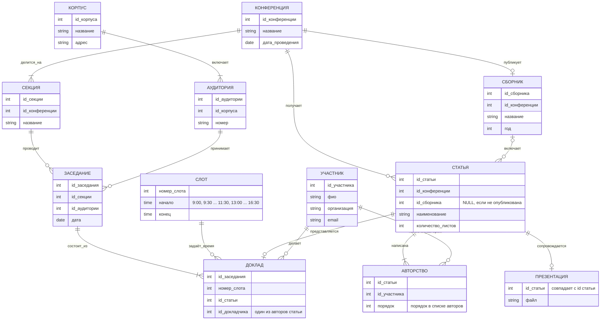
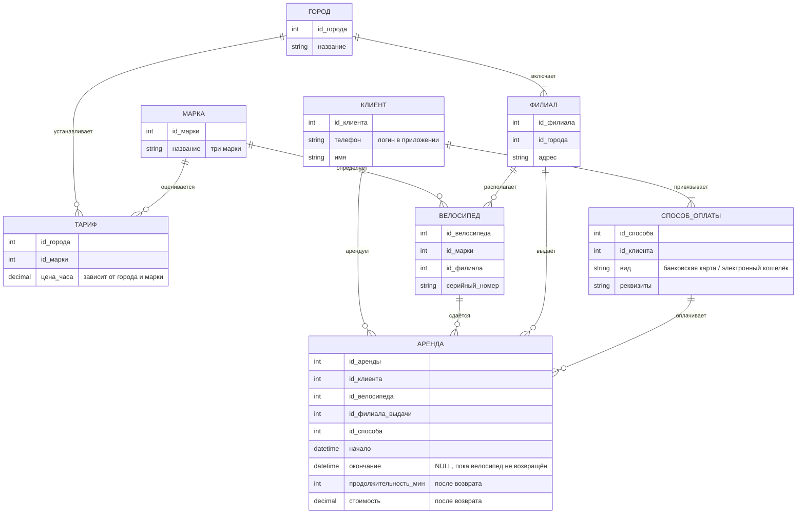
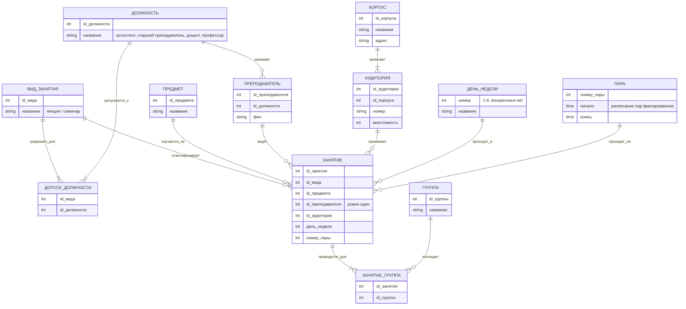

6. Пиццерия

```mermaid
erDiagram
    ФИЛИАЛ {
        int id_филиала
        string название
        string адрес
    }

    КУРЬЕР {
        int id_курьера
        int id_филиала
        string фио
        string телефон
    }

    КЛИЕНТ {
        int id_клиента
        string фио
        string телефон
    }

    ПРОДУКТ {
        int id_продукта
        string название
        string единица_измерения "г, мл, шт"
    }

    ТИП_ПИЦЦЫ {
        int id_типа
        string название
        decimal цена
    }

    СОСТАВ_ПИЦЦЫ {
        int id_типа
        int id_продукта
        decimal количество
    }

    ЗАКАЗ {
        int id_заказа
        int id_клиента
        int id_филиала
        int id_курьера "NULL, пока курьер не назначен"
        datetime дата_время
        string способ_заказа "телефон / интернет"
        string адрес_доставки "указывает клиент"
        string статус
    }

    ПОЗИЦИЯ_ЗАКАЗА {
        int id_заказа
        int id_типа
        int количество
        decimal цена "цена на момент заказа"
    }

    ФИЛИАЛ ||--o{ КУРЬЕР : "нанимает"
    ФИЛИАЛ ||--o{ ЗАКАЗ : "принимает"
    КЛИЕНТ ||--o{ ЗАКАЗ : "оформляет"
    КУРЬЕР |o--o{ ЗАКАЗ : "доставляет"
    ЗАКАЗ ||--|{ ПОЗИЦИЯ_ЗАКАЗА : "содержит"
    ТИП_ПИЦЦЫ ||--o{ ПОЗИЦИЯ_ЗАКАЗА : "заказывается"
    ТИП_ПИЦЦЫ ||--|{ СОСТАВ_ПИЦЦЫ : "состоит_из"
    ПРОДУКТ ||--o{ СОСТАВ_ПИЦЦЫ : "входит_в"
```

7. Курьерская доставка

```mermaid
erDiagram
    ГОРОД {
        int id_города
        string название
    }

    ФИЛИАЛ {
        int id_филиала
        int id_города
        string название
        string адрес "пункт приёма и выдачи"
    }

    КУРЬЕР {
        int id_курьера
        int id_филиала
        string фио
        string телефон
    }

    КЛИЕНТ {
        int id_клиента
        string фио
        string телефон
    }

    АДРЕС {
        int id_адреса
        int id_клиента
        int id_города
        string улица
        string дом
        string квартира
    }

    ТАРИФ_ДОСТАВКИ {
        int id_города_откуда
        int id_города_куда
        decimal стоимость "для каждой пары городов своя"
    }

    ОТПРАВЛЕНИЕ {
        int id_отправления
        int id_отправителя
        int id_получателя
        string описание
        string способ_приёма "филиал / курьер"
        int id_филиала_приёма "NULL, если вызван курьер"
        int id_адреса_забора "NULL, если сдано в филиале"
        int id_курьера_забора "NULL, если сдано в филиале"
        string способ_выдачи "пункт выдачи / адрес"
        int id_филиала_выдачи "NULL, если доставка по адресу"
        int id_адреса_доставки "NULL, если выдача в пункте"
        int id_курьера_доставки "NULL, если выдача в пункте"
        decimal стоимость_доставки "по тарифу на момент отправки"
        decimal стоимость_курьера "фиксированная, NULL, если курьер не нужен"
        date дата_отправки
        date дата_получения "NULL, пока не вручено"
    }

    ГОРОД ||--|{ ФИЛИАЛ : "имеет"
    ФИЛИАЛ ||--o{ КУРЬЕР : "нанимает"
    ГОРОД ||--o{ АДРЕС : "содержит"
    КЛИЕНТ ||--o{ АДРЕС : "имеет"
    ГОРОД ||--o{ ТАРИФ_ДОСТАВКИ : "откуда"
    ГОРОД ||--o{ ТАРИФ_ДОСТАВКИ : "куда"
    КЛИЕНТ ||--o{ ОТПРАВЛЕНИЕ : "отправляет"
    КЛИЕНТ ||--o{ ОТПРАВЛЕНИЕ : "получает"
    ФИЛИАЛ |o--o{ ОТПРАВЛЕНИЕ : "принимает"
    ФИЛИАЛ |o--o{ ОТПРАВЛЕНИЕ : "выдаёт"
    АДРЕС |o--o{ ОТПРАВЛЕНИЕ : "адрес_забора"
    АДРЕС |o--o{ ОТПРАВЛЕНИЕ : "адрес_доставки"
    КУРЬЕР |o--o{ ОТПРАВЛЕНИЕ : "забирает"
    КУРЬЕР |o--o{ ОТПРАВЛЕНИЕ : "доставляет"
```

8. Научная конференция

```mermaid
erDiagram
    КОНФЕРЕНЦИЯ {
        int id_конференции
        string название
        date дата_проведения
    }

    УЧАСТНИК {
        int id_участника
        string фио
        string организация
        string email
    }

    СЕКЦИЯ {
        int id_секции
        int id_конференции
        string название
    }

    КОРПУС {
        int id_корпуса
        string название
        string адрес
    }

    АУДИТОРИЯ {
        int id_аудитории
        int id_корпуса
        string номер
    }

    ЗАСЕДАНИЕ {
        int id_заседания
        int id_секции
        int id_аудитории
        date дата
    }

    СЛОТ {
        int номер_слота
        time начало "9:00, 9:30 ... 11:30, 13:00 ... 16:30"
        time конец
    }

    СБОРНИК {
        int id_сборника
        int id_конференции
        string название
        int год
    }

    СТАТЬЯ {
        int id_статьи
        int id_конференции
        int id_сборника "NULL, если не опубликована"
        string наименование
        int количество_листов
    }

    АВТОРСТВО {
        int id_статьи
        int id_участника
        int порядок "порядок в списке авторов"
    }

    ПРЕЗЕНТАЦИЯ {
        int id_статьи "совпадает с id статьи"
        string файл
    }

    ДОКЛАД {
        int id_заседания
        int номер_слота
        int id_статьи
        int id_докладчика "один из авторов статьи"
    }

    КОНФЕРЕНЦИЯ ||--|{ СЕКЦИЯ : "делится_на"
    КОНФЕРЕНЦИЯ ||--o| СБОРНИК : "публикует"
    КОНФЕРЕНЦИЯ ||--o{ СТАТЬЯ : "получает"
    СБОРНИК |o--o{ СТАТЬЯ : "включает"
    СТАТЬЯ ||--|{ АВТОРСТВО : "написана"
    УЧАСТНИК ||--o{ АВТОРСТВО : "является_автором"
    СТАТЬЯ ||--o| ПРЕЗЕНТАЦИЯ : "сопровождается"
    СЕКЦИЯ ||--o{ ЗАСЕДАНИЕ : "проводит"
    КОРПУС ||--|{ АУДИТОРИЯ : "включает"
    АУДИТОРИЯ ||--o{ ЗАСЕДАНИЕ : "принимает"
    ЗАСЕДАНИЕ ||--|{ ДОКЛАД : "состоит_из"
    СЛОТ ||--o{ ДОКЛАД : "задаёт_время"
    СТАТЬЯ ||--o| ДОКЛАД : "представляется"
    УЧАСТНИК ||--o{ ДОКЛАД : "делает"
```

9. Прокат велосипедов

```mermaid
erDiagram
    ГОРОД {
        int id_города
        string название
    }

    ФИЛИАЛ {
        int id_филиала
        int id_города
        string адрес
    }

    МАРКА {
        int id_марки
        string название "три марки"
    }

    ТАРИФ {
        int id_города
        int id_марки
        decimal цена_часа "зависит от города и марки"
    }

    ВЕЛОСИПЕД {
        int id_велосипеда
        int id_марки
        int id_филиала
        string серийный_номер
    }

    КЛИЕНТ {
        int id_клиента
        string телефон "логин в приложении"
        string имя
    }

    СПОСОБ_ОПЛАТЫ {
        int id_способа
        int id_клиента
        string вид "банковская карта / электронный кошелёк"
        string реквизиты
    }

    АРЕНДА {
        int id_аренды
        int id_клиента
        int id_велосипеда
        int id_филиала_выдачи
        int id_способа
        datetime начало
        datetime окончание "NULL, пока велосипед не возвращён"
        int продолжительность_мин "после возврата"
        decimal стоимость "после возврата"
    }

    ГОРОД ||--|{ ФИЛИАЛ : "включает"
    ГОРОД ||--o{ ТАРИФ : "устанавливает"
    МАРКА ||--o{ ТАРИФ : "оценивается"
    МАРКА ||--o{ ВЕЛОСИПЕД : "определяет"
    ФИЛИАЛ ||--o{ ВЕЛОСИПЕД : "располагает"
    КЛИЕНТ ||--|{ СПОСОБ_ОПЛАТЫ : "привязывает"
    КЛИЕНТ ||--o{ АРЕНДА : "арендует"
    ВЕЛОСИПЕД ||--o{ АРЕНДА : "сдаётся"
    ФИЛИАЛ ||--o{ АРЕНДА : "выдаёт"
    СПОСОБ_ОПЛАТЫ ||--o{ АРЕНДА : "оплачивает"
```

10. Расписание занятий

```mermaid
erDiagram
    ДЕНЬ_НЕДЕЛИ {
        int номер "1-6, воскресенья нет"
        string название
    }

    ПАРА {
        int номер_пары
        time начало "расписание пар фиксированное"
        time конец
    }

    ВИД_ЗАНЯТИЯ {
        int id_вида
        string название "лекция / семинар"
    }

    ДОЛЖНОСТЬ {
        int id_должности
        string название "ассистент, старший преподаватель, доцент, профессор"
    }

    ДОПУСК_ДОЛЖНОСТИ {
        int id_вида
        int id_должности
    }

    ПРЕПОДАВАТЕЛЬ {
        int id_преподавателя
        int id_должности
        string фио
    }

    ПРЕДМЕТ {
        int id_предмета
        string название
    }

    ГРУППА {
        int id_группы
        string название
    }

    КОРПУС {
        int id_корпуса
        string название
        string адрес
    }

    АУДИТОРИЯ {
        int id_аудитории
        int id_корпуса
        string номер
        int вместимость
    }

    ЗАНЯТИЕ {
        int id_занятия
        int id_вида
        int id_предмета
        int id_преподавателя "ровно один"
        int id_аудитории
        int день_недели
        int номер_пары
    }

    ЗАНЯТИЕ_ГРУППА {
        int id_занятия
        int id_группы
    }

    ВИД_ЗАНЯТИЯ ||--|{ ДОПУСК_ДОЛЖНОСТИ : "разрешён_для"
    ДОЛЖНОСТЬ ||--|{ ДОПУСК_ДОЛЖНОСТИ : "допускается_к"
    ДОЛЖНОСТЬ ||--o{ ПРЕПОДАВАТЕЛЬ : "занимает"
    ВИД_ЗАНЯТИЯ ||--o{ ЗАНЯТИЕ : "классифицирует"
    ПРЕДМЕТ ||--o{ ЗАНЯТИЕ : "изучается_на"
    ПРЕПОДАВАТЕЛЬ ||--o{ ЗАНЯТИЕ : "ведёт"
    КОРПУС ||--|{ АУДИТОРИЯ : "включает"
    АУДИТОРИЯ ||--o{ ЗАНЯТИЕ : "принимает"
    ДЕНЬ_НЕДЕЛИ ||--o{ ЗАНЯТИЕ : "проходит_в"
    ПАРА ||--o{ ЗАНЯТИЕ : "проходит_на"
    ЗАНЯТИЕ ||--|{ ЗАНЯТИЕ_ГРУППА : "проводится_для"
    ГРУППА ||--o{ ЗАНЯТИЕ_ГРУППА : "посещает"
```
